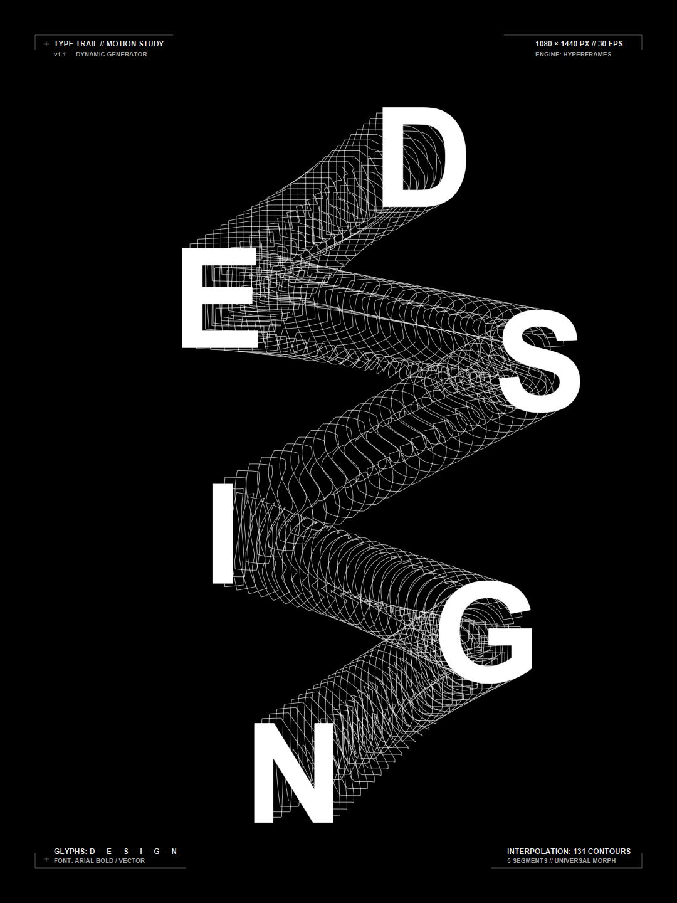

# Type Trail DESIGN — Illustrator "Blend Tool" Dynamic Poster

[English](#english) | [中文说明](#中文说明) · [Live Interactive Demo / 在线体验](https://jacknao2000-crypto.github.io/type-trail-blend/preview.html)



---

<a id="english"></a>
## English

This project recreates the iconic **Adobe Illustrator "Blend Tool" ribbon effect** across the complete word **"DESIGN"** (**D → E → S → I → G → N**) as a code-driven, high-fidelity dynamic poster. Powered by **HyperFrames**, Python mathematical geometry extraction, arc-length resampling, and cyclic phase alignment, finished with Swiss international style hairline typography.

### Deliverables & Files

| File | Description |
| :--- | :--- |
| `type_trail_design.mp4` | 6.0s, 30fps, 1080×1440 high-bitrate MP4 video |
| `static_poster.png` | 1080×1440 high-resolution poster (PNG) |
| `preview.html` | Standalone browser player with interactive scrubber slider |
| `index.html` | HyperFrames composition source (DOM + 131 SVG paths + GSAP timeline) |
| `build_composition.py` | Python pipeline: TrueType extraction, morphing, and baking |
| `hyperframes.json` | HyperFrames project configuration (1080x1440, 30fps, 6s) |
| `fonts/arialbd.ttf` | Embedded bold sans-serif typeface (Arial Bold) |
| `snapshots/` | Milestone review snapshots and contact sheets |

### Visual Design & Geometry Specifications

1. **Canvas**: 1080 × 1440 portrait, solid pitch-black (`#000000`) background.
2. **Serpentine Diagonal Trajectory** (Anchor centers derived from reference composition):
   - **D**: `(677, 251)`, cap height 165px (top-right)
   - **E**: `(351, 475)`, cap height 165px (top-left)
   - **S**: `(861, 576)`, cap height 165px (mid-right)
   - **I**: `(355, 851)`, cap height 165px (mid-left)
   - **G**: `(774, 1008)`, cap height 165px (lower-right)
   - **N**: `(469, 1233)`, cap height 165px (bottom-left)
3. **Wireframe Ribbon Contours**:
   - 5 transition segments: `D → E`, `E → S`, `S → I`, `I → G`, `G → N`.
   - 26 intermediate steps per segment = **131 total SVG contour layers**.
   - Stroke: `1.0px`, soft white (`rgba(255, 255, 255, 0.65)`), fill none.
4. **Top-Layer Solid Masks**:
   - 6 solid pure white (`#ffffff`) letters overlaid on top.
   - D employs the `evenodd` fill rule to preserve its counter hole (letting the background ribbon show through), while the solid glyph stems cleanly occlude the wireframe lines underneath.
5. **Swiss International Corner Typography**:
   - Hairline `0.75px` rules, registration crosshairs (`+`), and technical metadata in all four corners for a contemporary editorial aesthetic.

### Animation Timeline (6.0 Seconds)

- **0.0s – 0.4s**: Corner hairline graphics and typography fade in; solid D appears.
- **0.4s – 1.3s**: Ribbon sweeps from D to E; solid E lights up at `1.3s`.
- **1.3s – 2.2s**: Ribbon sweeps across from E to S; solid S lights up at `2.2s`.
- **2.2s – 3.1s**: Ribbon curves from S down into I; solid I lights up at `3.1s`.
- **3.1s – 4.0s**: Ribbon unfolds into G's circular bowl; solid G lights up at `4.0s`.
- **4.0s – 4.9s**: Ribbon charges diagonally into N; final solid N lights up at `4.9s`.
- **4.9s – 6.0s**: Complete poster of 131 contour layers and 6 solid letters fully locked in static hold.

### Core Algorithmic Implementation

1. **Sub-pixel TrueType Bézier Extraction**: Using `fontTools` and `pycairo`, native quadratic B-splines from `arialbd.ttf` are flattened into continuous closed polygon loops with curvature-adaptive precision, preserving sharp architectural corners.
2. **Centroid Normalization & Uniform Arc-length Resampling**: Each glyph outline is normalized to its bounding box centroid `(0, 0)` and resampled into $N = 500$ equidistant vertices by cumulative polyline arc length.
3. **Cyclic Phase Shift Minimization**: To eliminate vertex twisting and polygon self-intersection between radically different topologies (e.g. 3-arm E to sinuous S):
   $$\min_{s \in [0, N-1]} \sum_{i=0}^{N-1} \|A_i - B_{(i + s) \bmod N}\|^2$$
   The optimal cyclic shift $s$ is computed via circular distance minimization, guaranteeing smooth, untangled transitional vectors.
4. **Topological Counter Collapse**: Letter D is Genus 1 (has an inner hole), whereas E, S, I, G, N are Genus 0 (single boundary). The hole is isolated as an independent sub-path in segment $D \to E$ and linearly scaled down to zero towards its centroid over $t \in [0, 0.90]$, emulating Illustrator's counter interpolation behavior.
5. **Deterministic Baked DOM + GPU Acceleration**: All 131 contour paths are pre-computed into static SVG paths inside `index.html`. GSAP drives discrete visibility states, ensuring 100% deterministic frame rendering during scrubbing, seeking, and GPU video export.

### Quick Start & Regeneration (v1.1)

```bash
# 1. Clone the repository
git clone https://github.com/jacknao2000-crypto/type-trail-blend.git
cd type-trail-blend

# 2. Generate the default "DESIGN" flagship poster
python build_composition.py

# 3. (NEW in v1.1) Generate blend posters for ANY custom word:
python build_composition.py --text "FUTURE"
python build_composition.py --text "MOTION" --steps 30 --duration 7.0
python build_composition.py --text "CREATIVE"

# 4. Render high-res MP4 video via HyperFrames CLI:
npx hyperframes render --quality high --output my_custom_poster.mp4

# 5. Preview locally:
# Open preview.html directly in any browser!
```

---

<a id="中文说明"></a>
## 中文说明

本项目根据参考构图，使用 **HyperFrames** 配合矢量轮廓重采样与特征插值算法，完整复现了 Adobe Illustrator 中「混合工具（Blend Tool）」在全词 **「DESIGN」**（**D → E → S → I → G → N**）之间的空间形态演化与致密矢量线束海报效果，并配以四角现代版式排版细节。

在 **v1.1 版本** 中，本工程已进一步升级为**支持任意文字的通用命令行海报生成器**。

### v1.1 核心特性 (v1.1 Highlights)

1. **任意文字支持 (`--text`)**：可输入任意英文单词（如 `FUTURE`、`MOTION`、`CREATIVE`），自动提取字形矢量。
2. **全自动蛇形排版**：根据单词字数自适应计算对角 Z 字形或蛇形折返坐标，自适应调整字号大小。
3. **全自动多孔洞拓扑识别**：无论包含 A、B、D、O、P、Q、R 中的哪种带孔字母，算法自动识别内外轮廓，并在过渡过程中平滑收敛与展开，杜绝自交。
4. **一键生成与预览**：自动更新四角版式小字，输出 1080×1440 高清海报与配套动态网页。

### 命令行快速上手 (v1.1)

```bash
# 生成默认 DESIGN 旗舰海报
python build_composition.py

# 生成任意自定义单词（如 FUTURE、MOTION）
python build_composition.py --text "FUTURE"
python build_composition.py --text "MOTION" --steps 30 --duration 7.0

# 导出高清 MP4 视频 (需安装 hyperframes)
npx hyperframes render --quality high --output poster.mp4
```

### 交付文件清单

| 文件路径 | 说明 |
| :--- | :--- |
| `static_poster.png` | 1080×1440 最终全词静态海报 (PNG) |
| `type_trail_design.mp4` | 6.0 秒、30fps、1080×1440 高画质 MP4 视频 |
| `preview.html` | 本地原生播放预览页面（含播放/暂停/拖拽进度/时间码） |
| `index.html` | HyperFrames 核心合成文件（DOM + 131 层 SVG 轮廓 + GSAP 时间线） |
| `build_composition.py` | 矢量字形提取、特征重采样、孔洞过渡与海报生成脚本 |
| `hyperframes.json` | HyperFrames 工程配置文件 (1080x1440, 30fps, 6s) |
| `fonts/arialbd.ttf` | 本地内嵌粗体无衬线字体文件 (Arial Bold) |
| `snapshots/` | 关键帧与审校快照 (contact-sheet.jpg) |

### 构图与视觉设计规范

1. **画幅与背景**：1080×1440 竖版，纯黑（`#000000`）背景。
2. **蛇形折返空间定位（像素级匹配参考图）**：
   - **D**：`(677, 251)`，字高 165px
   - **E**：`(351, 475)`，字高 165px
   - **S**：`(861, 576)`，字高 165px
   - **I**：`(355, 851)`，字高 165px
   - **G**：`(774, 1008)`，字高 165px
   - **N**：`(469, 1233)`，字高 165px
3. **顶层实心遮罩**：
   - 6 个字母的实心纯白层置于顶层。
   - D 采用 `evenodd` 规则剔除内孔（透出底层穿过的线束）；其余字母实体完全遮盖下方底层的线束。
4. **四角版式排版与极细辅助线**：
   - 左上：`TYPE TRAIL // MOTION STUDY`、`VOL. 02 — VECTOR INTERPOLATION` 与十字准星。
   - 右上：`1080 × 1440 PX // 30 FPS`、`ENGINE: HYPERFRAMES` 与折角标尺。
   - 左下：`GLYPHS: D — E — S — I — G — N`、`FONT: ARIAL BOLD / VECTOR`。
   - 右下：`INTERPOLATION: 136 CONTOURS`、`5 SEGMENTS // 26 STEPS // GENUS 0-1`。

### 动画时序编排 (6.0 秒)

- **0.0s – 0.4s**：四角精致线条与元数据小字微光淡入，起点实心 D 显现。
- **0.4s – 1.3s**：线束自 D 展开至 E；`1.3s` 实心 E 显现。
- **1.3s – 2.2s**：线束横扫至 S；`2.2s` 实心 S 显现。
- **2.2s – 3.1s**：线束弯折穿透至 I；`3.1s` 实心 I 显现。
- **3.1s – 4.0s**：线束舒展旋入 G；`4.0s` 实心 G 显现。
- **4.0s – 4.9s**：线束倾斜贯通至 N；`4.9s` 终点实心 N 显现。
- **4.9s – 6.0s**：全幅 131 层线束与四角版式排版完整定格，震撼呈现。

### 核心实现方法总结

1. **高精度字形提取**：使用 `fontTools` 读取 `arialbd.ttf` 的二次贝塞尔曲线数据，通过 `pycairo` 转换为亚像素级闭合多边形，消除不同字重和轮廓之间的几何误差。
2. **中心归一化与环形相位对齐**：将各字形轮廓以形心居中归一化，通过弧长等距重采样为 500 点多边形，并采用循环位移距离极小化算法（Cyclic Phase Alignment）自动对齐相邻两字轮廓起始点，确保过渡形态平滑无交叉撕裂。
3. **拓扑孔洞过渡控制**：显式隔离 D 的内孔环，在第一段过渡中以形心为原点平滑缩小至零，完美契合 Illustrator 混合算法的视觉逻辑。
4. **确定性 HyperFrames DOM 预生成**：131 层 SVG `<path>` 轮廓全部预先烘焙进 HTML，通过 GSAP 驱动时序与透明度，在任意 Seek 帧下均提供 100% 确定且高保真的渲染结果。

---

## License

MIT License.
