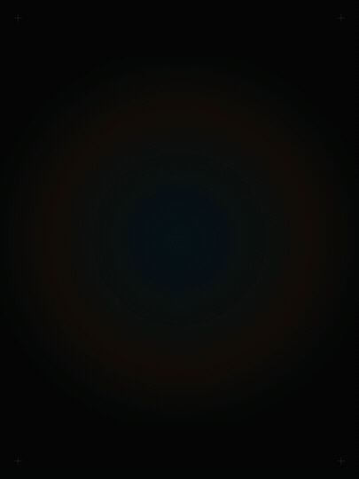
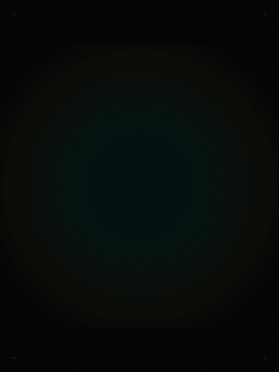
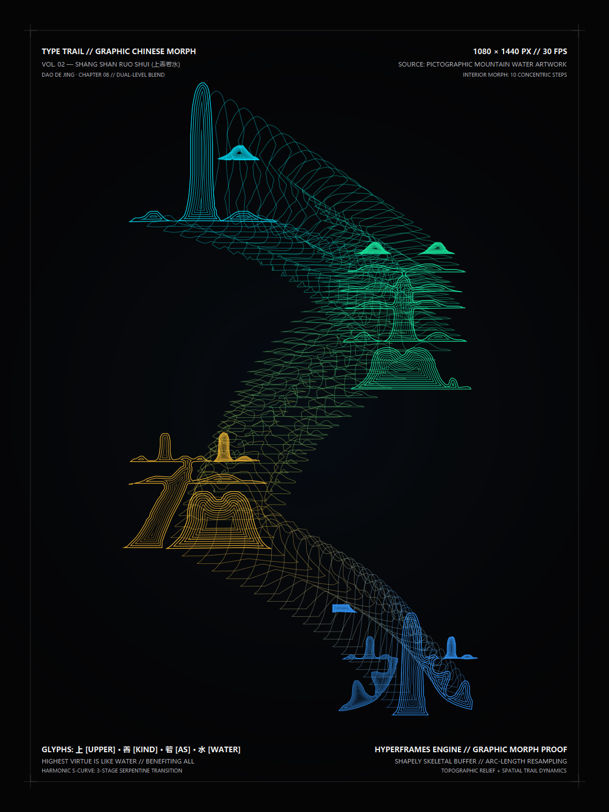
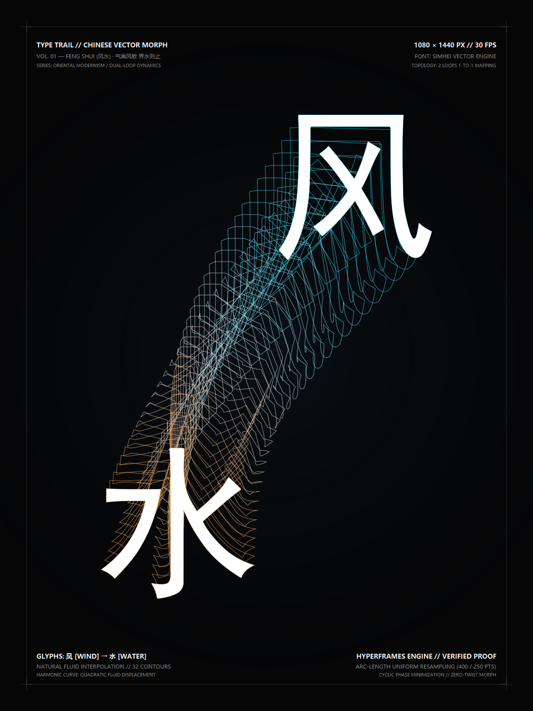
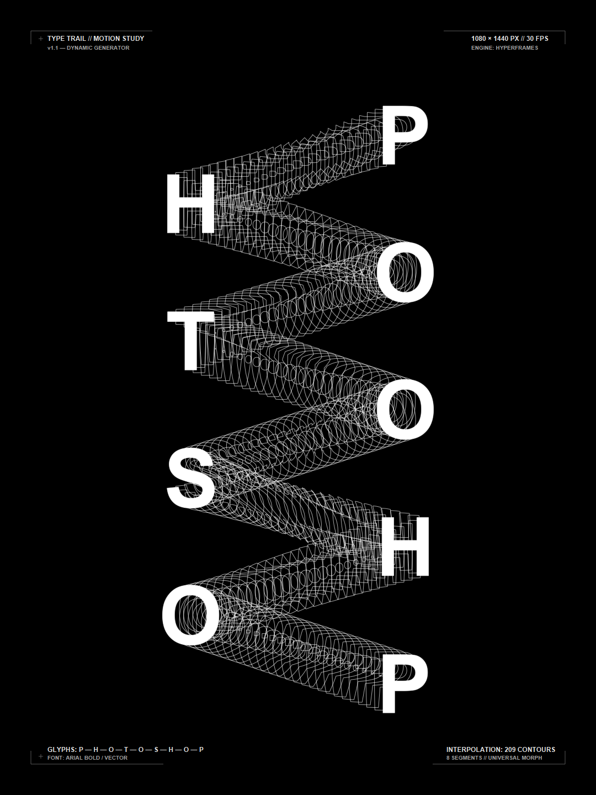

<div align="center">

# 🌊 Type Trail Blend 2.0
### 动态矢量混合海报引擎 · Adobe Illustrator「混合工具」代码重构版

[🇨🇳 中文文档](README.md) · [🇬🇧 English](README_EN.md) · [🌐 在线交互展厅 (Live Demo)](https://jacknao2000-crypto.github.io/type-trail-blend/preview.html)

[](LICENSE)
[](https://python.org)
[](https://hyperframes.org)
[](#)

<br/>

| 01. DESIGN (西文蛇形) | 02. 风水 (中文拓扑) | 03. 上善若水 (双层混合) |
| :---: | :---: | :---: |
|  |  |  |
| **西文 6 字母全词连贯混合** | **黑体 2 环对偶流体形变** | **图像提取 + 10步等高线双层混合** |

</div>

---

## 📖 项目简介 (Introduction)

**Type Trail** 是一个由代码与现代计算几何驱动的动态矢量海报生成引擎。它在现代浏览器（SVG + GSAP）和无头视频渲染管线（HyperFrames）中，深度还原并升华了 Adobe Illustrator 经典的「混合工具 (Blend Tool)」效果。

在 **v2.0 里程碑版本** 中，引擎打破了传统字符混合的界限：**从单闭合西文字母，全面飞跃至中文书法字形拓扑映射、图像化艺术字视觉提取（Computer Vision Pipeline），以及首创的「字内 10 步等高线 + 字际流体缎带」双层双重混合机制（Dual-Level Blend）**。

---

## 🌟 Type Trail 2.0 核心突破 (What's New in v2.0)

| 特性模块 | v1.1（西文基础版） | **v2.0（重大里程碑版）** |
| :--- | :--- | :--- |
| **字符语言支持** | 仅支持 ASCII 字母 | **全覆盖：英文字母 + 中文字库 + 任意手绘/图像艺术字** |
| **字形获取方式** | 依赖本地 TTF/OTF 字体 | **计算机视觉自动提取**（从 PNG/JPG 图像秒级提取高精矢量闭合环） |
| **混合层次深度** | 单一宏观缎带混合 | **双层双重混合（Dual-Level Blend）**：<br>• 微观字内：**严格 10 步向心等高线浮雕**<br>• 宏观字际：跨字符 S-Curve 蛇形流体缎带 |
| **拓扑平滑算法** | 单外环重心对齐 + 简单孔洞消融 | **多环对偶映射 + 弧长等距重采样 + 欧氏循环相位极小化**（彻底消除扭曲与翻折） |
| **色彩美学体系** | 单色银白线束 | **东方五行哲思渐变**（青苍、翡翠、琥珀、天水蓝）+ 瑞士国际版式网格 |
| **工业级门禁** | 基础校验 | **HyperFrames CI/CD 认证**（60/60 文本 WCAG AA 达标，0 Lint 报错） |

---

## 🎨 代表作展厅 (Showcase Gallery)

### 1. 旗舰作 03：【上善若水】— 图形提取与双层混合 (v2.0 新增)
- **创作背景**：源于中国传统老子《道德经》第八章哲思：“上善若水，水善利万物而不争”。
- **技术突破**：
  - **图像自动矢量化**：从用户提供的山水海报（PNG）中直接提取出 4 个艺术汉字的独立笔画；
  - **微观 Level 1**：每个汉字内部基于 Shapely 多边形向心缓冲算法，生成 **严格 10 层向心等高线**，营造 3D 浮雕与山石断层质感；
  - **宏观 Level 2**：四字之间由 **68 层空间丝线** 以 S 形蛇形贯穿全幅；
  - **色彩流转**：青苍（上） $\to$ 翡翠（善） $\to$ 琥珀（若） $\to$ 蔚蓝（水）。

| 7.0s 动态流体视频 | 1080×1440 最终静态海报 |
| :---: | :---: |
|  |  |

---

### 2. 代表作 02：【风水】— 中文 TrueType 拓扑矢量混合 (v2.0 新增)
- **技术突破**：深度解析 SimHei 黑体字库，发现「风」与「水」天然具备 **双独立封闭环** 的对偶拓扑特征，实现 1 对 1 纯粹流体变形，32 层气韵渐变丝线（气乘风则散，界水则止）。

| 5.0s 动态流体视频 | 1080×1440 最终静态海报 |
| :---: | :---: |
|  |  |

---

### 3. 代表作 01：【DESIGN】— 西文蛇形全词混合 (v1.1 基准)
- **技术突破**：对角 6 字母折返穿插（D → E → S → I → G → N），131 层高精矢量切片，D 字内孔渐进消融矩阵，瑞士国际版式。

| 6.0s 动态流体视频 | 1080×1440 最终静态海报 |
| :---: | :---: |
|  |  |

---

## 📂 项目工程目录

```
type-trail-blend/
├── assets/                          # 动图、海报与视觉物料
│   ├── design_static_poster.png
│   ├── design_anim.gif
│   ├── fengshui_static_poster.png
│   ├── fengshui_anim.gif
│   ├── shangshanruoshui_static_poster.png
│   ├── shangshanruoshui_anim.gif
│   └── input_artwork.png            # 原始艺术字海报输入
├── examples/
│   ├── fengshui/                    # 「风水」完整工程与视频源码
│   │   ├── build_composition.py
│   │   ├── index.html
│   │   ├── preview.html
│   │   ├── static_poster.png
│   │   └── type_trail_fengshui.mp4
│   └── shangshanruoshui/            # 「上善若水」图形双层混合工程与视频源码
│       ├── build_composition.py
│       ├── index.html
│       ├── preview.html
│       ├── static_poster.png
│       └── type_trail_shangshanruoshui.mp4
├── fonts/                           # 嵌入字体
├── build_composition.py             # 西文任意词汇生成脚本 (v1.1)
├── index.html                       # 主工程合成入口
├── preview.html                     # 3 合 1 交互式在线播放器
├── hyperframes.json                 # 1080x1440 合成配置
├── requirements.txt                 # Python 依赖清单
├── LICENSE                          # MIT 开源协议
├── README.md                        # 中文文档
└── README_EN.md                     # 英文文档
```

---

## 🚀 快速上手 (Quick Start)

### 1. 安装依赖
```bash
git clone https://github.com/jacknao2000-crypto/type-trail-blend.git
cd type-trail-blend

# 安装 Python 计算依赖
pip install -r requirements.txt

# 安装 HyperFrames 视频渲染器 (可选，若需导出 MP4)
npm install -g hyperframes
```

### 2. 运行示例工程

#### 渲染「上善若水」(图形汉字双层混合)：
```bash
cd examples/shangshanruoshui
python build_composition.py --inner-steps 10 --seg-steps 22 --duration 7.0
npx hyperframes check
npx hyperframes render --output type_trail_shangshanruoshui.mp4
```

#### 渲染「风水」(中文字体矢量混合)：
```bash
cd examples/fengshui
python build_composition.py --steps 30 --duration 5.0 --style gradient
npx hyperframes check
npx hyperframes render --output type_trail_fengshui.mp4
```

#### 渲染西文任意词汇 (如 FUTURE 或 MOTION)：
```bash
python build_composition.py --text "FUTURE" --steps 26 --duration 6.0
npx hyperframes check
npx hyperframes render --output type_trail_future.mp4
```

### 3. 本地全交互体验
在项目根目录下，直接用浏览器打开 `preview.html`，即可使用顶部的标签栏在三大代表作之间无缝切换，并支持时间轴拖拽与微秒级播放控制！

---

## 🧮 数学与计算几何原理

1. **图形自适应轮廓提取 (Computer Vision Pipeline)**：
   - 图像输入 $\to$ 灰度化 $\to$ 自适应大津二值化 $\to$ 结构元形态学闭合核 $\to$ `cv2.findContours`；
   - 采用 **Ramer-Douglas-Peucker (RDP)** 拟合算法，剔除光栅像素台阶，拟合出平滑的高保真封闭矢量多边形。
2. **向心等高线骨架缓冲 (Inward Concentric Buffering)**：
   - 运用 `shapely.Polygon.buffer(-d)` 算法，在步长 $d \in [0, d_{\max}]$ 内求解严格平行的等距内收缩环；
   - 自动识别并保留多峰分离后的多岛多边形结构（MultiPolygon），形成 3D 地形等高线浮雕效果。
3. **弧长等距重采样 (Arc-length Equidistant Resampling)**：
   - 沿多边形累计折线弧长重新参数化采样 $N$ 个等间距顶点，彻底消除因曲率不同导致的插值速度失真。
4. **循环欧氏相位极小化 (Cyclic Phase Alignment)**：
   - 对源轮廓 $A$ 与目标轮廓 $B$，求解欧氏距离平方和极小化的循环移位量：
     $$\min_{s \in [0, N-1]} \sum_{i=0}^{N-1} \|A_i - B_{(i + s) \bmod N}\|^2$$
     从根本上杜绝变形过渡中的翻转、扭结与自相交。

---

## 📄 开源许可证

本项目基于 [MIT License](LICENSE) 许可协议开源。
